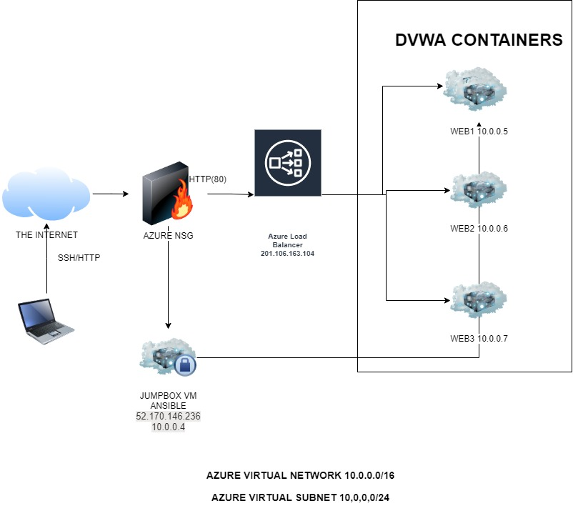
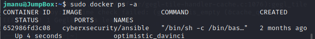

## Automated ELK Stack Deployment

The files in this repository were used to configure the network depicted below.

These files have been tested and used to generate a live ELK deployment on Azure. They can be used to either recreate the entire deployment pictured above. Alternatively, select portions of the __yaml__ file may be used to install only certain pieces of it, such as Filebeat.

  - _[Project_1/Ansible at main · goukiep/Project_1 (github.com)](https://github.com/goukiep/Project_1/tree/main/Ansible)._

This document contains the following details:
- Description of the Topology
- Access Policies
- ELK Configuration
  - Beats in Use
  - Machines Being Monitored
- How to Use the Ansible Build

### Description of the Topology

The main purpose of this network is to expose a load-balanced and monitored instance of DVWA, the D*mn Vulnerable Web Application.

Load balancing ensures that the application will be highly __available__, in addition to restricting __public access__ to the network.
- _The load balancer distribute traffic, and prevent the servers to overload and ensures that in case of one server fail, the web server still works. Having a jump box protect the network in the case of the credentials leak, an atacker will only have access to the JumpBox and not the other machines because those have different credentials._

Integrating an ELK server allows users to easily monitor the vulnerable VMs for changes to the __configuration__ and system __logs__.
- _What does Filebeat watch for?_Filebeat monitors the log files or locations that we specify, collects log events, and forwards them either to Elk-Server for indexing.
- _What does Metricbeat record? Metribeat uses modules to collect metrics from any specific service to be index and review later._

The configuration details of each machine may be found below.

| Name     | Function | IP Address | Operating System |
|----------|----------|------------|------------------|
| Jump Box | Gateway  | 10.0.0.4   | Linux            |
| Web1     |  DVWA    | 10.0.0.5   | Linux            |
| Web2     |  DVWA    | 10.0.0.6   | Linux            |
| Web3     |  DVWA    | 10.0.0.7   | Linux            |
|ELK-Server|Log-Monitor| 10.1.0.4  | Linux            |
 
### Access Policies

The machines on the internal network are not exposed to the public Internet. 

Only the __JumpBox__ machine can accept connections from the Internet. Access to this machine is only allowed from the following IP addresses:
- _99.***.***.91_

Machines within the network can only be accessed by __SSH__.
- _The only machine allowed to connect to those machines was the JumpBox machine with the ip address 10.0.0.4_
- _The ELK-Server its publicly accessible for the use of kibana, but its restricted to only  the public ip of my personal computer. _
- 
A summary of the access policies in place can be found in the table below.

| Name     | Publicly Accessible | Allowed IP Addresses |
|----------|---------------------|----------------------|
| Jump Box | Yes                 | My personal IP    |
| ELK-Server         |   Yes:5601                  |    99.***.***.91                  |
| Web1         |No                     |    10.0.0.4                  |
| Web2         |No                     |    10.0.0.4           |
| Web3         |No                     |    10.0.0.4              |

### Elk Configuration

Ansible was used to automate configuration of the ELK machine. No configuration was performed manually, which is advantageous because the configuration could be standardize, changes in the configuration can be done with changing some lines of code,etc.

The playbook implements the following tasks:
- _TODO: In 3-5 bullets, explain the steps of the ELK installation play. E.g., install Docker; download image; etc._
-   Install docker.io
-   Install python3-pip
-   Install docker via pip
-   Increase vitual memory
- ...

The following screenshot displays the result of running `docker ps` after successfully configuring the ELK instance.

### Target Machines & Beats
This ELK server is configured to monitor the following machines:
- _TODO: List the IP addresses of the machines you are monitoring_

We have installed the following Beats on these machines:
- _TODO: Specify which Beats you successfully installed_

These Beats allow us to collect the following information from each machine:
- _TODO: In 1-2 sentences, explain what kind of data each beat collects, and provide 1 example of what you expect to see. E.g., `Winlogbeat` collects Windows logs, which we use to track user logon events, etc._

### Using the Playbook
In order to use the playbook, you will need to have an Ansible control node already configured. Assuming you have such a control node provisioned: 

SSH into the control node and follow the steps below:
- Copy the _____ file to _____.
- Update the _____ file to include...
- Run the playbook, and navigate to ____ to check that the installation worked as expected.

_TODO: Answer the following questions to fill in the blanks:_
- _Which file is the playbook? Where do you copy it?_
- _Which file do you update to make Ansible run the playbook on a specific machine? How do I specify which machine to install the ELK server on versus which to install Filebeat on?_
- _Which URL do you navigate to in order to check that the ELK server is running?

_As a **Bonus**, provide the specific commands the user will need to run to download the playbook, update the files, etc._

> Written with [StackEdit](https://stackedit.io/).
<!--stackedit_data:
eyJoaXN0b3J5IjpbLTE1NTcwNDkwNDgsMzM1Mjc5ODI4LDE5Nz
UwMDQ3MzcsOTEwMjY0Nzg3XX0=
-->